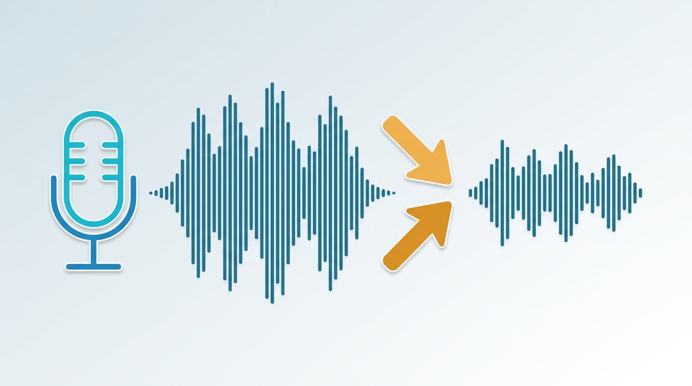
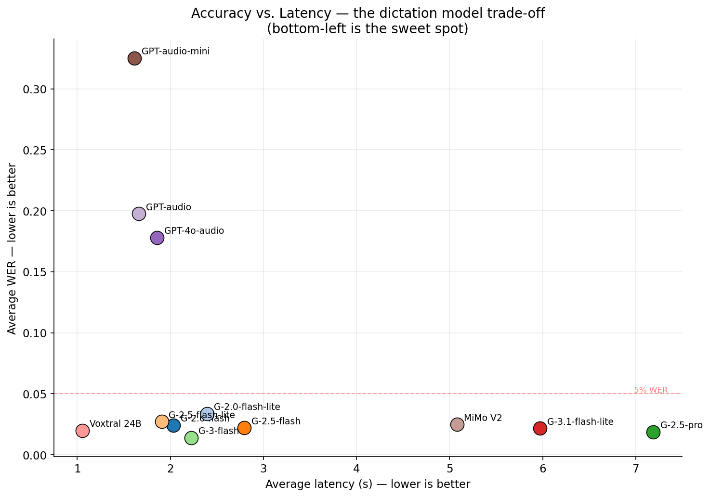
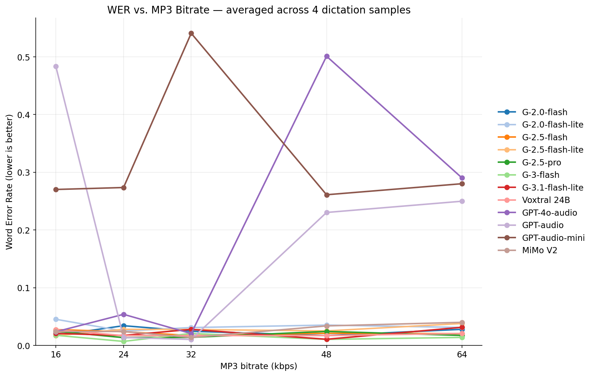
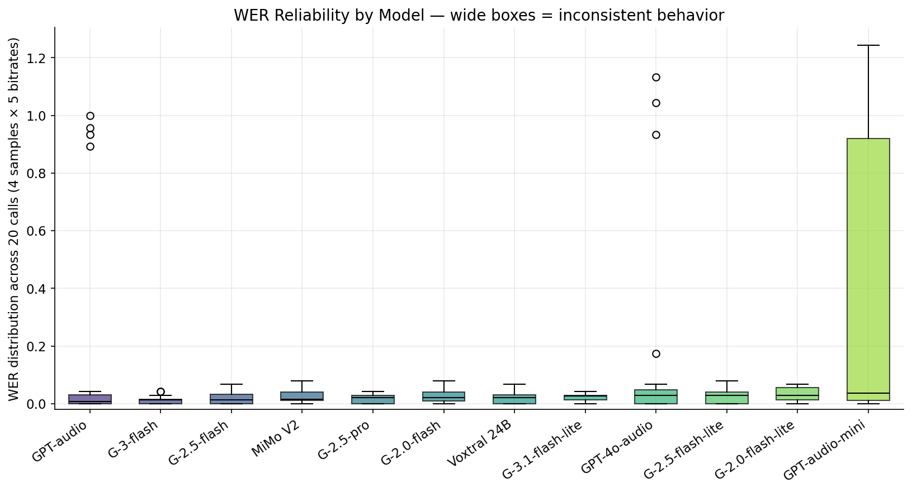

# Audio Understanding — MP3 Bitrate Evaluation (April 2026)



Empirical eval measuring how MP3 compression bitrate affects transcription accuracy across every audio-input LLM available on [OpenRouter](https://openrouter.ai).

**Question**: If you're sending voice dictation audio to a multimodal LLM, how low can you drop the MP3 bitrate before transcription accuracy degrades?

📝 **Blog post**: [MP3 Bitrate Sensitivity in Audio-Multimodal LLMs](https://huggingface.co/blog/danielrosehill/audio-multimodal-bitrate-wer)
📦 **HF dataset**: [`danielrosehill/Audio-Understanding-Bitrate-Eval-0426`](https://huggingface.co/datasets/danielrosehill/Audio-Understanding-Bitrate-Eval-0426)

## TL;DR

Ran a benchmark across **12 OpenRouter audio-multimodal models × 4 dictation samples × 5 MP3 bitrates** (16/24/32/48/64 kbps) = 240 API calls. Three findings:

1. **Does lower bitrate mean higher WER? Not really.** For Gemini and Voxtral, WER is statistically flat across 16-64 kbps. Sending audio above ~16 kbps wastes bandwidth and adds latency for no accuracy gain. **Drop your default to 32 kbps MP3 mono 16 kHz.** Most production dictation pipelines are over-provisioning audio quality by 2-4×.

2. **Best bang for the buck: `mistralai/voxtral-small-24b-2507`** — sub-second latency, WER ~0.02. 2-8× faster than comparable-accuracy Gemini variants. The model to beat for latency-sensitive transcription. For pure accuracy the top pick is **`google/gemini-3-flash-preview`** (WER 0.014); **Gemini 2.5 Pro is strictly dominated** (same accuracy, 3-4× slower, 5-10× costlier).

3. **Instruction adherence matters more than compression.** OpenAI's GPT-Audio family (all three variants) fails the verbatim-transcription task ~25-40% of the time — not because the audio is noisy or the model mishears, but because it decides to *respond conversationally* to the content instead of transcribing it, overriding an explicit verbatim prompt. WER on those failure calls hits 0.9-1.2. **Don't use GPT-Audio for verbatim transcription without an output validator.** Gemini and Voxtral don't exhibit this behavior.

**Why this matters**: audio-multimodal LLMs collapse the conventional two-stage ASR+cleanup pipeline into a single pass. That architectural advantage evaporates if the model won't reliably do the task you asked.

Full results: [`results/summary.md`](results/summary.md) · Raw per-call data: [`results/all.csv`](results/all.csv).

## At a glance

**The model trade-off** — bottom-left is the sweet spot (fast + accurate):



**WER barely moves with bitrate** for Gemini/Voxtral (green cluster) — OpenAI GPT-Audio family (top) is wildly inconsistent:



**Reliability**: wide boxes = inconsistent behavior across the 20 calls per model. OpenAI models have long tails from occasional conversational responses; Gemini and Voxtral are tight:



More charts in [`plots/`](plots/). Regenerate any time with `python3 scripts/plot_results.py`.

## Why this eval exists

Most guidance on audio bitrates for ML (e.g. Whisper, Deepgram) assumes you're feeding audio to a dedicated ASR model. Audio-input LLMs (Gemini's audio-capable tiers, GPT-Audio, Voxtral, MiMo) are a different animal — they tokenize audio through their own encoders and the behavior vs. bitrate isn't well characterized in public benchmarks.

This eval produces that characterization for the OpenRouter-accessible set, across **12 models × 4 dictation samples × 5 bitrates = 240 API calls**.

## What's in this repo

| Path | Contents |
|---|---|
| `samples/` | The 4 source recordings (WAV, 16-bit mono 16 kHz) with paired `.reference.txt` ground-truth transcripts |
| `variants/` | Pre-encoded MP3 copies of each sample at 16, 24, 32, 48, 64 kbps — the exact bytes sent to each API |
| `results/all.csv` | Machine-readable results: `model, sample, bitrate_kbps, payload_kb, elapsed_s, wer, error` |
| `results/summary.md` | Aggregated WER × latency table (model × bitrate) |
| `results/<model>/<sample>/` | Per-(model, sample) breakdown with full transcription text at each bitrate |
| `methodology.md` | How the eval was run — prompt, scoring, encoding pipeline, caveats |
| `reproduce.md` | How to re-run the eval on your own hardware/key |

## Dataset availability

The same content is mirrored as a Hugging Face dataset:
[`danielrosehill/Audio-Understanding-Bitrate-Eval-0426`](https://huggingface.co/datasets/danielrosehill/Audio-Understanding-Bitrate-Eval-0426)

The GitHub repo is the source of truth for methodology and code; the HF dataset is a packaged distribution for `datasets.load_dataset()` workflows.

## Tooling

The eval was run from the [Multimodal Voice Typer](https://github.com/danielrosehill/AI-Typer-V2) repo (`evals/full_sweep.py`), which is the voice-dictation app the findings feed back into.

## License

Code, results, and documentation: [MIT](LICENSE).
Audio samples: CC0 — public domain, do whatever you want with them.

## Citation

If this is useful in your work, a link back to either the GitHub repo or the HF dataset is appreciated but not required.

```
Rosehill, D. (2026). Audio Understanding — MP3 Bitrate Evaluation.
https://github.com/danielrosehill/Audio-Understanding-Bitrate-Eval-0426
```
